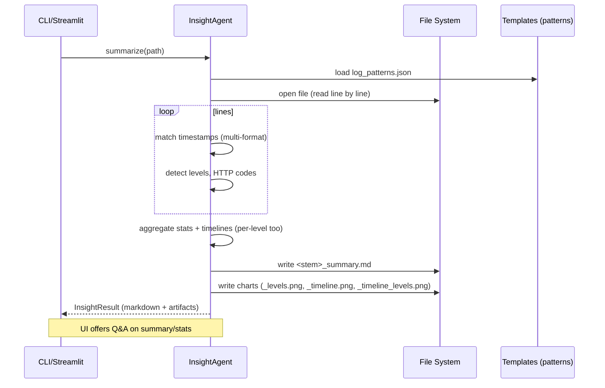
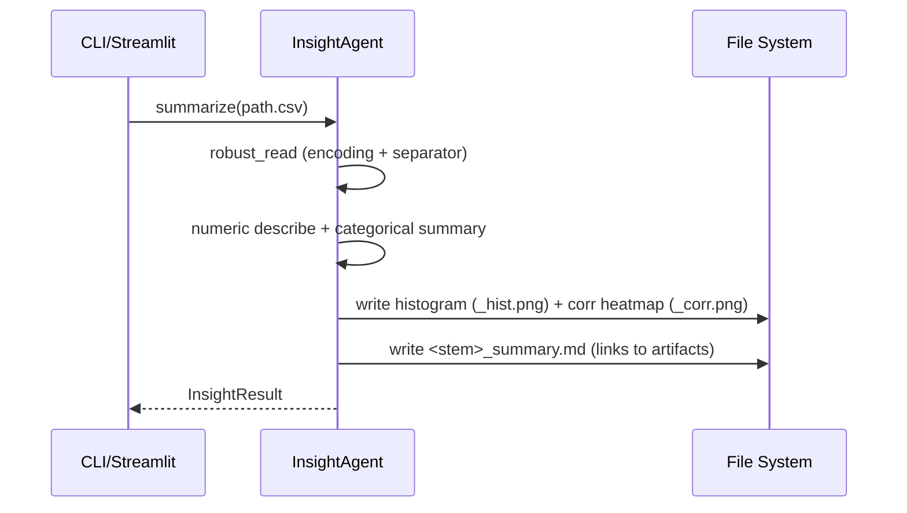
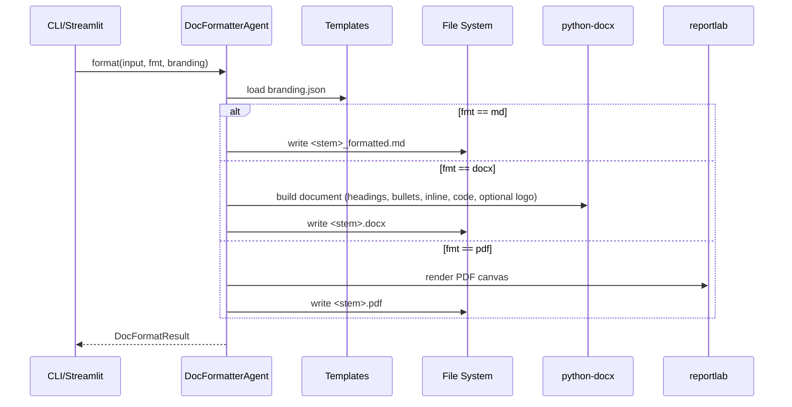
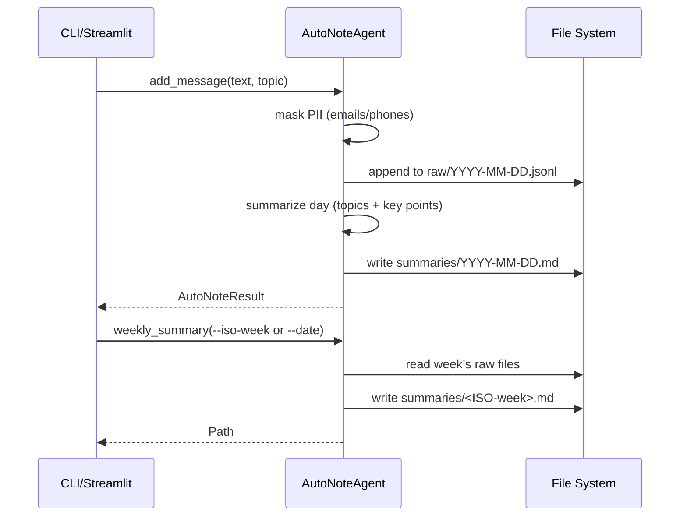
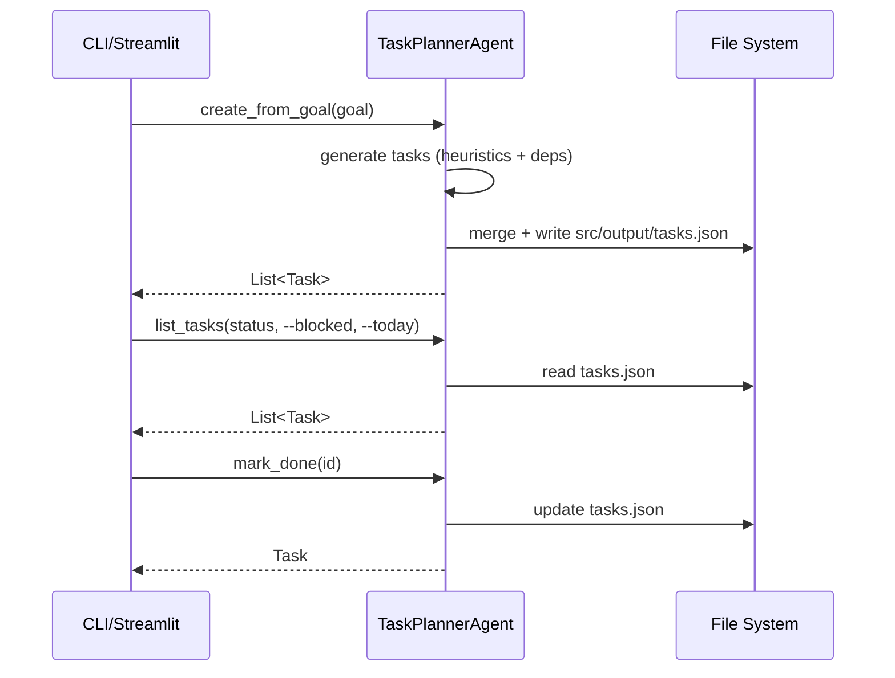
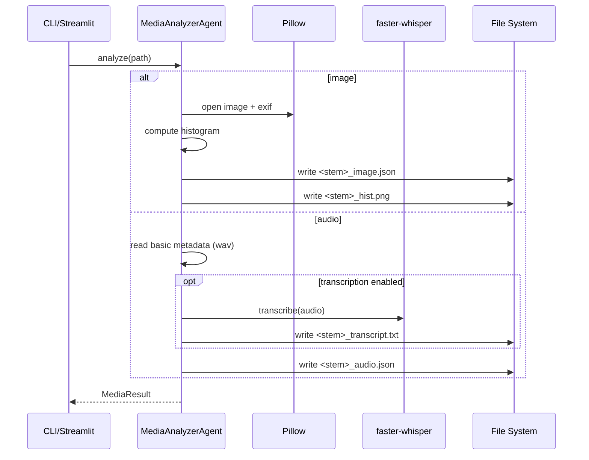

# Architecture

This document explains the architecture, modules, data flows, and runtime interactions of the multi‑agent toolkit, including sequence diagrams for core operations.

## Goals
- Keep each agent small, focused, and independently usable.
- Provide both CLI and Streamlit UI surfaces over the same agent APIs.
- Ensure safe optional dependencies with graceful fallbacks (e.g., charts, transcription).
- Persist outputs locally for easy inspection and reproducibility.

## High‑Level Overview

- Entry points
  - CLI: `src/main.py`
  - Web UI: `src/ui/app.py` (Streamlit)
- Agents (in `src/agents/`)
  - InsightAgent: quick analytics for `.txt/.log/.csv`, charts, 1‑page summary
  - DocFormatterAgent: text → Markdown/DOCX/PDF with branding
  - AutoNoteAgent: daily memory capture with summaries and weekly rollups
  - TaskPlannerAgent: goal → prioritized task list with estimates and deps
  - MediaAnalyzerAgent: image/audio metadata, histograms, transcription
- Local storage
  - Outputs: `src/output/` (per‑agent subfolders + tasks DB)
  - Memory: `src/memory/` (raw notes JSONL, daily/weekly summaries)
  - Templates: `src/templates/` (branding, log patterns)

## Core Utilities

- `src/paths.py`: centralized paths (`BASE`, `SRC`, `OUT`, `MEM`, `TPL`) + `ensure_dirs()`
- `src/config.py`: env‑driven config (timezone, default topic, feature flags)
- `src/logging_setup.py`: rotating file logging under `src/output/logs/app.log` + global exception hook
- `src/optional.py`: feature detection for optional deps (`matplotlib`/`python-docx`/`reportlab`/`faster-whisper`)
- `src/models.py`: Pydantic models for results and task items

## Directory Structure

```
E:/Coding/Agents/Agent/
├─ src/
│  ├─ main.py                 # CLI entry (subcommands)
│  ├─ paths.py                # BASE/OUT/MEM/TPL helpers
│  ├─ config.py               # feature flags, defaults
│  ├─ logging_setup.py        # logging + exception hook
│  ├─ optional.py             # optional dep checks
│  ├─ models.py               # Pydantic result models
│  ├─ agents/
│  │  ├─ insight_agent.py
│  │  ├─ doc_formatter_agent.py
│  │  ├─ auto_note_agent.py
│  │  ├─ task_planner_agent.py
│  │  └─ media_analyzer_agent.py
│  ├─ ui/
│  │  └─ app.py               # Streamlit UI
│  ├─ memory/                 # AutoNote outputs (gitkept)
│  ├─ output/                 # Generated outputs (gitkept)
│  └─ templates/              # Branding + log_patterns.json
├─ examples/                  # Sample data for smoke testing
├─ docs/
│  └─ architecture.md         # This document
├─ requirements.txt
├─ README.md
└─ .gitignore
```

## Data Flow (Cross‑Cutting)

- Input sources: user files (upload or path) and free‑form text.
- Processing: agents parse inputs, compute stats/derivations, and optionally render charts.
- Outputs: Markdown, JSON, images, DOCX/PDF, and memory files written under `src/output/` or `src/memory/`.
- Configuration: JSON templates in `src/templates/` control branding (`branding.json`) and log patterns (`log_patterns.json`).

## Dependencies and Fallbacks

- Required for full feature set: `pandas`, `matplotlib`, `Pillow`, `python-docx`, `reportlab`, `streamlit`.
- Optional: `faster-whisper` (audio transcription). If disabled or missing, MediaAnalyzerAgent skips transcription.
- Agents are robust to missing heavy deps and write Markdown fallbacks where applicable.

## Module Responsibilities

- InsightAgent
  - Detects file type: `.csv` vs. text/log
  - CSV: robust reader (encodings + separators), missingness, numeric describe, categorical summary (limited, meaningful columns), histogram and correlation heatmap
  - LOG/TXT: line/word/byte counts, time range, level counts, HTTP 4xx/5xx totals and per‑code counts, sample lines, overall and per‑level timelines
  - Patterns via `templates/log_patterns.json` with multi‑format timestamps and level/HTTP regexes
  - Writes 1‑page summary `.md` and charts under `src/output/insight/<stem>/`

- DocFormatterAgent
  - Loads branding (`branding.json` or named template + optional `logo`)
  - MD output: header + content
  - DOCX: headings/bullets, inline bold/italic/code/links, fenced code blocks, optional logo image
  - PDF: simple layout (title/subtitle/date + wrapped body)
  - Falls back to MD if DOCX/PDF dependencies are not installed

- AutoNoteAgent
  - Masks PII (emails/phones) before writing raw entries to `src/memory/raw/YYYY-MM-DD.jsonl`
  - Generates daily summaries in `src/memory/summaries/`
  - Resummarize a day by `--date`, and weekly rollups by `--iso-week` or `--date`

- TaskPlannerAgent
  - Heuristic goal parsing → small prioritized task list with dependencies
  - CRUD: create/list/done; list filters `--blocked` and `--today` supported
  - Store: `src/output/tasks.json` with stable IDs

- MediaAnalyzerAgent
  - Image: EXIF (if present), format/mode/size, histograms (matplotlib)
  - Audio: WAV metadata; transcription via `faster-whisper` when enabled and installed
  - JSON report + optional chart/transcript saved in `src/output/media/`

## Sequence Diagrams

### 1) InsightAgent (Text/Log)



### 2) InsightAgent (CSV)



### 3) DocFormatterAgent



### 4) AutoNoteAgent



### 5) TaskPlannerAgent



### 6) MediaAnalyzerAgent



## Component Graph (High‑Level)

```mermaid
graph TB
  subgraph UI
    ST[Streamlit Web UI]
    CLI[CLI (src/main.py)]
  end

  subgraph Agents
    IA[InsightAgent]
    DFA[DocFormatterAgent]
    ANA[AutoNoteAgent]
    TPA[TaskPlannerAgent]
    MAA[MediaAnalyzerAgent]
  end

  TPL[Templates (branding, log patterns)]
  OUT[(Output dir)]
  MEM[(Memory dir)]
  EXAMPLES[(Examples)]

  subgraph Deps (optional)
    PD[pandas]
    MPL[matplotlib]
    PIL[Pillow]
    DOCX[python-docx]
    PDF[reportlab]
    FW[faster-whisper]
  end

  ST --> IA
  ST --> DFA
  ST --> ANA
  ST --> TPA
  ST --> MAA

  CLI --> IA
  CLI --> DFA
  CLI --> ANA
  CLI --> TPA
  CLI --> MAA

  IA --> TPL
  DFA --> TPL

  IA --> OUT
  DFA --> OUT
  TPA --> OUT
  MAA --> OUT

  ANA --> MEM

  IA -. uses .-> PD
  IA -. charts .-> MPL
  MAA -. images .-> PIL
  DFA -. docx .-> DOCX
  DFA -. pdf .-> PDF
  MAA -. transcript .-> FW

  ST --- EXAMPLES
  CLI --- EXAMPLES
```

## Output Layout

- Insight: `src/output/insight/<stem>/...`
- DocFormatter: `src/output/docfmt/...`
- Media: `src/output/media/...`
- Tasks DB: `src/output/tasks.json`
- AutoNote memory: `src/memory/raw/YYYY-MM-DD.jsonl`, `src/memory/summaries/YYYY-MM-DD.md`, `src/memory/summaries/YYYY-Www.md`

## UI Details

- Streamlit app: `src/ui/app.py` (legacy shim: `web/app.py` redirects here)
- Sidebar toggles: charts and transcription feature flags
- Recent outputs: right‑column panels for Insight/DocFormatter/Media and AutoNote/Planner
- Load example buttons: preloaded files in `examples/`
- Insight Q&A: asks questions against the latest summary/stats

## Error Handling Strategy
- Agents catch optional dependency errors and fall back to simpler outputs.
- File I/O errors are surfaced to the CLI/UI and do not crash the app.
- Charts are best‑effort; absence of matplotlib simply omits chart sections.

## Security and Privacy
- All processing and storage are local by default.
- No external network calls are required for standard flows.
- Uploaded files via Streamlit are written to `src/output/uploads/`.

## Extensibility
- Add new agents under `src/agents/` and expose them via:
  - CLI: `src/main.py` with a new subcommand
  - Web: `src/ui/app.py` with a new page function
- Extend Insight patterns and DocFormatter templates via JSON without code changes.

## Build and Run
- CLI: `python -m src.main --help`
- Web: `streamlit run src/ui/app.py`
- Environment: Python 3.10+, virtualenv recommended

```
.venv\Scripts\Activate.ps1
pip install -r requirements.txt
streamlit run src/ui/app.py
```

## Runbook (Common Issues)

- 404/connection refused on http://127.0.0.1:8501
  - Make sure the app is running; use `run_web.ps1` or `run_web.bat`
  - Close old Streamlit tabs and relaunch; avoid rerunning missing `web/app.py` paths
  - Allow Python in the firewall dialog (local loopback)
- ModuleNotFoundError (e.g., `pydantic`, `config`)
  - Activate venv and `pip install -r requirements.txt`
  - For Streamlit, ensure `src/` is on `sys.path` (handled in `src/ui/app.py`)
- Missing optional features
  - Charts require `matplotlib`; transcription requires `faster-whisper`
  - UI will degrade gracefully and show a note if disabled or missing
- CSV read errors
  - Insight uses robust encodings/sep fallbacks; see summary “Note: encoding=…, sep=…”
- Port conflicts
  - Launch with a different port: `run_web.ps1 -Port 8502` or `run_web.bat 8502`

## Known Limitations
- Markdown→DOCX parsing is intentionally light (basic inline formatting, code, headings, bullets).
- CSV summaries show only small previews of tables.
- Transcription uses CPU by default; large files may be slow.

## Future Enhancements
- Settings page to configure models (e.g., `tiny`, `base`) and output directories.
- Richer Markdown table and code styling in DOCX and PDF.
- Additional Insight visualizations (moving averages, anomaly flags).
- Plugin architecture for new agent types (e.g., OCR, web scraping) reusing the UI shell.
